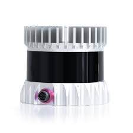
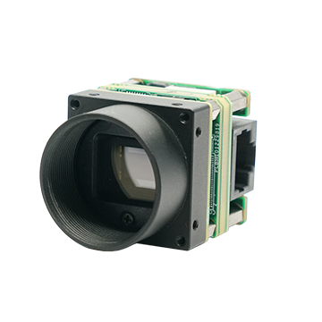
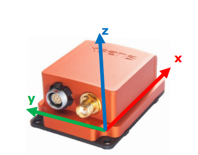
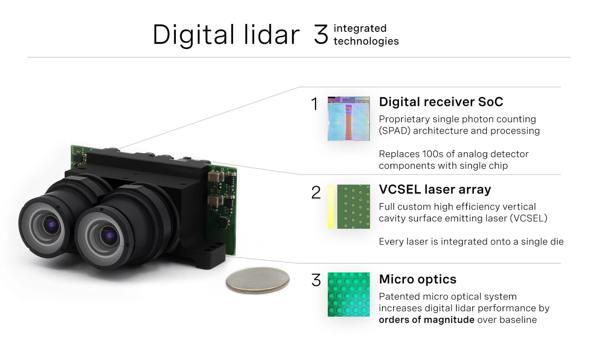
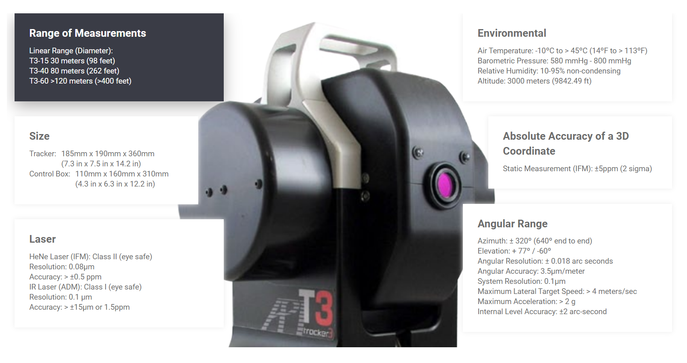

## Overview

The sensor setup is illustrated in [Fig. 1](#fig-harware). The corresponding ROS topics are reported in [Tab. 1](#tab-sensor-and-topic).

<p align="center">
    <td></td>
</p>


<table class="tg">
<thead>
  <tr>
    <th class="tg-c3ow">No.</th>
    <th class="tg-c3ow" width="15%">Sensor</th>
    <th class="tg-c3ow">Manufacturer<br>&amp; Product name</th>
    <th class="tg-c3ow">ROS topic name</th>
    <th class="tg-c3ow">Message Type</th>
    <th class="tg-c3ow" width="10%">Nominal Rate</th>
    <th class="tg-c3ow">Pics</th>
  </tr>
</thead>
<tbody>
  <tr>
    <td class="tg-c3ow" rowspan="1">1</td>
    <td class="tg-c3ow" rowspan="1">IMU/INS</td>
    <td class="tg-c3ow" rowspan="1">Xsens MTi-G-710</td>
    <td class="tg-0pky">/imu/data</td>
    <td class="tg-0pky">sensor_msgs/Imu</td>
    <td class="tg-c3ow">400 Hz</td>
    <td></td>
  </tr>
  <tr>
    <td class="tg-c3ow" rowspan="1">2</td>
    <td class="tg-c3ow" rowspan="1">Horizontal Lidar 1<br>(Mechanical LiDAR)</td>
    <td class="tg-c3ow" rowspan="1">Velodyne HDL32E</td>
    <td class="tg-0pky">/velodyne_points_HDL32</td>
    <td class="tg-0pky">sensor_msgs/PointCloud2</td>
    <td class="tg-c3ow">5 Hz(rotate at 10Hz)</td>
    <td></td>
  </tr>
  <tr>
    <td class="tg-c3ow" rowspan="2">3</td>
    <td class="tg-c3ow" rowspan="2">Horizontal Lidar 2<br>(Digital LiDAR)</td>
    <td class="tg-c3ow" rowspan="2">Ouster OS0-128</td>
    <td class="tg-0pky">/os0_cloud_node/imu</td>
    <td class="tg-0pky">sensor_msgs/Imu</td>
    <td class="tg-c3ow">100 Hz</td>
    <td></td>
  </tr>
  <tr>
    <td class="tg-0pky">/os0_cloud_node/points</td>
    <td class="tg-0pky">sensor_msgs/PointCloud2</td>
    <td class="tg-c3ow">10 Hz</td>
  </tr>
  <tr>
    <td class="tg-c3ow" rowspan="2">4</td>
    <td class="tg-c3ow" rowspan="2">Horizontal Lidar 3<br>(MEMS LiDAR)</td>
    <td class="tg-c3ow" rowspan="2">LiVOX Avia</td>
    <td class="tg-0pky">/livox/lidar</td>
    <td class="tg-0pky">livox_ros_driver/CustomMsg</td>
    <td class="tg-c3ow">10 Hz</td>
    <td></td>
  </tr>
  <tr>
    <td class="tg-0pky">/livox/imu</td>
    <td class="tg-0pky">sensor_msgs/Imu</td>
    <td class="tg-c3ow">200 Hz</td>
  </tr>
  <tr>
    <td class="tg-c3ow" rowspan="1">5</td>
    <td class="tg-c3ow" rowspan="1">Vertical Lidar 1<br>(Mechanical LiDAR)</td>
    <td class="tg-c3ow" rowspan="1">Velodyne VLP32C</td>
    <td class="tg-0pky">/velodyne_points_VLP32</td>
    <td class="tg-0pky">sensor_msgs/PointCloud2</td>
    <td class="tg-c3ow">10Hz</td>
    <td></td>
  </tr>
  <tr>
    <td class="tg-c3ow" rowspan="3">6</td>
    <td class="tg-c3ow" rowspan="3">Stereo Camera front</td>
    <td class="tg-c3ow" rowspan="3">PointGrey Bumblebee xb3</td>
    <td class="tg-0pky">/camera/left/image_raw</td>
    <td class="tg-0pky">sensor_msgs/Image</td>
    <td class="tg-c3ow">10 Hz</td>
  </tr>
  <tr>
    <td class="tg-0pky">/camera/center/image_raw</td>
    <td class="tg-0pky">sensor_msgs/Image</td>
    <td class="tg-c3ow">10 Hz</td>
    <td></td>
  </tr>
  <tr>
    <td class="tg-0pky">/camera/right/image_raw</td>
    <td class="tg-0pky">sensor_msgs/Image</td>
    <td class="tg-c3ow">10 Hz</td>
  </tr>
  <tr>
    <td class="tg-c3ow" rowspan="2">7</td>
    <td class="tg-c3ow" rowspan="2">Stereo Camera back</td>
    <td class="tg-c3ow" rowspan="2">PointGrey Bumblebee xb2</td>
    <td class="tg-0pky">/cam_xb2/left/image_raw</td>
    <td class="tg-0pky">sensor_msgs/Image</td>
    <td class="tg-c3ow">10-15 Hz</td>
    <td></td>
  </tr>
  <tr>
    <td class="tg-0pky">/cam_xb2/right/image_raw</td>
    <td class="tg-0pky">sensor_msgs/Image</td>
    <td class="tg-c3ow">10-15 Hz</td>
  </tr>
  <tr>
    <td class="tg-c3ow" rowspan="1">8</td>
    <td class="tg-c3ow" rowspan="1">Mono Camera 1<br>(With HDL32E)</td>
    <td class="tg-c3ow" rowspan="1">Hikvision MV-CB016-10GC-C</td>
    <td class="tg-0pky">/hik_camera/iamge_raw</td>
    <td class="tg-0pky">sensor_msgs/Image</td>
    <td class="tg-c3ow">20Hz</td>
    <td></td>
  </tr>
  <tr>
    <td class="tg-c3ow" rowspan="1">9</td>
    <td class="tg-c3ow" rowspan="1">Mono Camera 2<br>(With LiVOX Avia)</td>
    <td class="tg-c3ow" rowspan="1">Hikvision MV-CE060-10UC</td>
    <td class="tg-0pky">/hik_camera/iamge_raw</td>
    <td class="tg-0pky">sensor_msgs/Image</td>
    <td class="tg-c3ow">20Hz</td>
    <td></td>
  </tr>
</tbody>
</table>

## IMU
The IMU we use is Xsens MTi-G-710. It is a 9-DoF inertia sensor which gives roll, pitch, and yaw estimatio. 9-DoF IMU data is necessarily for some slam algorithms such as <a href="https://github.com/TixiaoShan/LIO-SAM">LIO-SAM</a>, our data can meet the requirment.


For more information of Xsens MTi-G-710：
<a href="../pdf/MTi_usermanual.pdf">User Manual of Xsens_MTi</a>

<table>
<tr>
<td></td>
<td></td>
</tr>
</table>
<p style="text-align: center;">Fig 2. The IMU frame of reference </p> <a name="fig-hardware"></a>

## Mechanical Lidar
### Horizontal Lidar 1
The first horizontal Lidar in the middle of the multisensors platform is Velodyne HDL-32E.
<a href="../pdf/MANUAL_USERS_HDL32E.pdf">User Manual of Velodyne_HDL_32E</a>

```cpp
struct PointXYZIRT
{
    PCL_ADD_POINT4D
    PCL_ADD_INTENSITY;
    uint16_t ring;
    float time;
    EIGEN_MAKE_ALIGNED_OPERATOR_NEW
} EIGEN_ALIGN16;

POINT_CLOUD_REGISTER_POINT_STRUCT (PointXYZIRT,  
                                    (float, x, x) 
                                    (float, y, y) 
                                    (float, z, z) 
                                    (float, intensity, intensity)
                                    (uint16_t, ring, ring) 
                                    (float, time, time))
```
### Vertical Lidar
垂直方向的Lidar is Velodyne VLP-32C(Ultra Puck).<a href="../pdf/VLP32CManual.pdf">User Manual of Velodyne_VLP_32C</a><br> The VLP-32C sensor uses 32 infra-red (IR) lasers paired with IR detectors to measure distances to objects. The device is mounted securely within a compact, weather-resistant housing. The assembly of laser/detector pairs spins rapidly within
its fixed housing to scan the surrounding environment, firing pairs of lasers approximately 18,000 times per second, providing, in real-time, a rich set of 3D point data.

## Digital Lidar
About digital lidar:
<td></td>
Ouster Company Said:<a href="https://ouster.com/blog/why-digital-lidar-is-the-future/">https://ouster.com/blog/why-digital-lidar-is-the-future/</a>

### Horizontal Lidar 2

The second horizontal Lidar in the middle of the multisensors platform is Ouster OS0-128.

```cpp
struct PointXYZIRT
{
    PCL_ADD_POINT4D;
    float intensity;
    uint32_t t;
    uint16_t reflectivity;
    uint8_t  ring;          // The channel index
    uint16_t noise;
    uint32_t range;         // The distance measurement
    EIGEN_MAKE_ALIGNED_OPERATOR_NEW
} EIGEN_ALIGN16;

POINT_CLOUD_REGISTER_POINT_STRUCT(PointXYZIRT,
                                  (float, x, x)
                                  (float, y, y)
                                  (float, z, z)
                                  (float, intensity, intensity)
                                  (uint32_t, t, t)
                                  (uint16_t, reflectivity, reflectivity)
                                  (uint8_t,  ring, ring)
                                  (uint16_t, noise, noise)
                                  (uint32_t, range, range))
```

## MEMS Lidar
We Use DJI LiVOX Avia Lidar in our dataset. It

With foundation responsive videos are easy. [More ›](http://foundation.zurb.com/docs/components/flex_video.html)

<iframe src="../video/avia_scan.mp4" frameborder="0" allowfullscreen style="width:50%;height:330px;" ></iframe>

Livox customized data package format, as follows:
```cpp
Header header             # ROS standard message header
uint64 timebase           # The time of first point
uint32 point_num          # Total number of pointclouds
uint8  lidar_id           # Lidar device id number
uint8[3]  rsvd            # Reserved use
CustomPoint[] points      # Pointcloud data
```
Customized Point Cloud (CustomPoint) format in the above customized data package:
```cpp
uint32 offset_time      # offset time relative to the base time
float32 x               # X axis, unit:m
float32 y               # Y axis, unit:m
float32 z               # Z axis, unit:m
uint8 reflectivity      # reflectivity, 0~255
uint8 tag               # livox tag
uint8 line              # laser number in lidar
```

## Stereo Cameras
There are three Stereo Cameras: Bumblebee_xb3(Frount View),Bumblebee_xb2(Back view) and ZED 2i(Below view).

## Mono Cameras

## Laser Tracker
The ground truth of our dataset is provided by API T3 Laser Tracker.
<a href="https://www.adm3d.com/Home/T3Tracker">https://www.adm3d.com/Home/T3Tracker</a>

