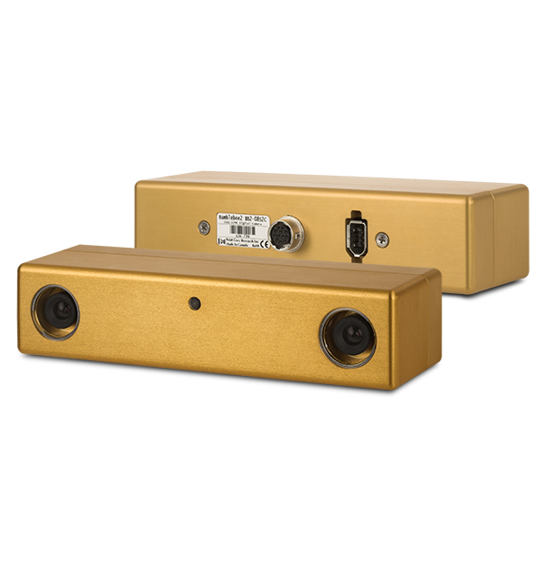

## Overview

The sensor setup is illustrated in [Fig. 1](#fig-harware). The corresponding ROS topics are reported in [Tab. 1](#tab-sensor-and-topic).

<table>
 <td width="40%">
 <table>
	<tr>
	    <th>Platform</th>
	</tr >
	<tr>
      <td rowspan="5"></td>
	</tr>

</table>
</td>
<td>
 <table>
 <thead>
	<tr>
      <th>Sensor</th>
      <th>type</th> 
      <th>Rate</th>
      <th>Pics</th>
	</tr >
  </thead>
	<tr>
      <td width="25%">INS/IMU</td>
      <td width="30%">Xsens MTi-G-710</td>
      <td width="15%">400 Hz</td>
      <td></td>
	</tr>
  <tr >
      <td width="25%">Horizontal Lidar</td>
      <td width="30%">Velodyne HDL-32E</td>
      <td width="10%">10 Hz</td>
      <td></td>
	</tr>
	<tr>
	    <td width="25%">Vertical Lidar</td>
      <td width="30%">Velodyne VLP-32C</td>
      <td width="10%">10 Hz</td>
      <td></td>
	</tr>
	<tr>
	    <td width="25%">MEMS Lidar</td>
      <td width="30%">LiVOX Avia</td>
      <td width="10%">10 Hz</td>
      <td></td>
	</tr>
	<tr>
	    <td width="25%">Stereo Camera front</td>
      <td width="30%">PointGrey BBX3-13S2C-38</td>
      <td width="10%">16 Hz</td>
      <td></td>
	</tr>
  <tr>
	    <td width="25%">Stereo Camera back</td>
      <td width="30%">PointGrey BBX2-08S2C-38</td>
      <td width="10%">20 Hz</td>
      <td></td>
	</tr>
	<tr>
	     <td width="25%">Mono Camera 1<br>(with HDL-32E)</td>
      <td width="30%">PointGrey CLMN-13S2C-CS</td>
      <td width="10%">16 Hz</td>
      <td></td>
	</tr>
	<tr>
	     <td width="25%">Mono Camera 2<br>(with LiVOX Avia)</td>
      <td width="30%">Hikvision MV-CE060-10UC</td>
      <td width="10%">40 Hz</td>
      <td></td>
	</tr>
</table>
</td>
</table>

## IMU

我们使用的IMU是Xsens MTi-G-710 GNSS/INS, 它是一个9-DoF传感器，可以提供三轴加速度、三轴角速度和三轴磁力计的数据，有许多SLAM算法例如LIO-SAM需要提供初始化的横滚、俯仰和偏航角，
rosbag的话题名称是`/imu/data`

<p align="center">
    
</p>
<p style="text-align: center;">Fig 2. The IMU frame of reference </p> <a name="fig-hardware"></a>

## Mechanical Lidar
### Horizontal Lidar
水平方向的激光雷达是Velodyne HDL-32E, 这个型号的雷达一共有32线激光发射器，
<a href="../pdf/MANUAL_USERS_HDL32E.pdf">链接文本</a>
```c
struct PointXYZIRT
{
    PCL_ADD_POINT4D;
    float intensity;
    uint32_t t;
    uint16_t reflectivity;
    uint8_t  ring;          // The channel index
    uint16_t noise;
    uint32_t range;         // The distance measurement
    EIGEN_MAKE_ALIGNED_OPERATOR_NEW
} EIGEN_ALIGN16;

POINT_CLOUD_REGISTER_POINT_STRUCT(PointXYZIRT,
                                  (float, x, x)
                                  (float, y, y)
                                  (float, z, z)
                                  (float, intensity, intensity)
                                  (uint32_t, t, t)
                                  (uint16_t, reflectivity, reflectivity)
                                  (uint8_t,  ring, ring)
                                  (uint16_t, noise, noise)
                                  (uint32_t, range, range))
```

Below is an example callback that converts the ros message `sensor_msgs/PointCloud2` to an object of type `pcl::Pointcloud<PointXYZIRT>` defined above:

```cpp
// Global variable to store the cloud data
pcl::PointCloud<PointXYZIRT>::Ptr laserCloudIn;

// Callback of topic /os1_cloud_node1/points
void cloudHandler(const sensor_msgs::PointCloud2::ConstPtr &msg)
{
    laserCloudIn->clear();
    pcl::fromROSMsg(*msg, *laserCloudIn);
}

// Subscribe to /os1_cloud_node1/points and allocate memory for the pointcloud somewhere in the main function
// Example: laserCloudIn = pcl::PointCloud<PointXYZIRT>::Ptr(new pcl::PointCloud<PointXYZIRT>());
```
### Vertical Lidar
垂直方向的激光雷达型号是Velodyne VLP-32C(Ultra Puck), The VLP-32C sensor uses 32 infra-red (IR) lasers paired with IR detectors to measure distances to objects. The device is mounted securely within a compact, weather-resistant housing. The assembly of laser/detector pairs spins rapidly within
its fixed housing to scan the surrounding environment, firing pairs of lasers approximately 18,000 times per second, providing, in real-time, a rich set of 3D point data.

## MEMS Lidar


## Stereo Cameras

## Mono Cameras

## Laser Tracker