## Overview

The acquisition system is illustrated in [Fig. 1](#fig-acsystme_1). It consists with three parts: Bucket Truck, Multisensors Platform and Ground Truth System.The bucket truck uses a hydraulic arm to lift the multi-sensor data acquisition system into the air. Well-calibrated and well-synchronized sensors such as cameras, Lidars, and IMUs collect multimodal data of the environment and motion information of the end of hydraulic arm. The laser tracker on the ground tracks the target prism on the motion platform, which provides millimeter-accurate 3D motion trajectories to provide benchmarks for positioning tasks.

    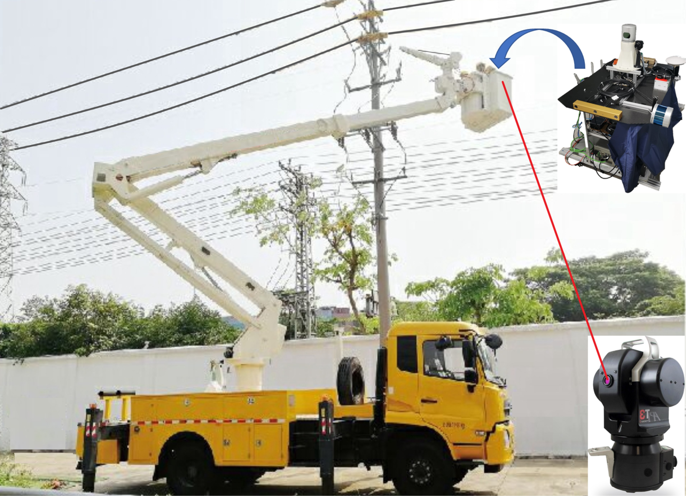

Fig 1. "Giraffe" Acquisition System 

## Bucket Truck
Bucket Truck is a truck equipped with an extendable, hydraulic boom carrying a large bucket for raising workers to elevated, inaccessible areas. (from <a href="https://www.merriam-webster.com/dictionary/bucket%20truck">《Webster's Dictionary》</a>)  

According to the official website of <a href="https://versalift.com/">Versalift Company</a>, "Bucket trucks are incredibly important to the industries that use them. Because so much of the power grid is connected through overhead means, and it must be managed and maintained, aerial lifts are essential to both the Power Distribution and Power Transmission Industries. Nearly every home and business in the United States is connected to the power grid, and so bucket trucks can be found throughout big cities and small towns, in suburban communities and in business districts. And they are also widely used in Telecommunications, Tree Care, Sign and Lighting Industries etc."
  

Our bucket Truck is produce by <a href="https://www.xcmg.com/en-ap/">XCMG Company</a>, the model is <a href="https://zj.lmjx.net/gaokongzuoyeche/xcmg/xgs5143jgkz6/param/">XCMG-XGS5143JGKZ</a>.   
The hydraulic arm of our bucket truck is produced by <a href="https://versalift.com/">Versalift Company</a>, the model is <a href="https://versalift.com/bucket-truck/vst-36-i/">VST-36-I</a>.
<table><tr>
<td>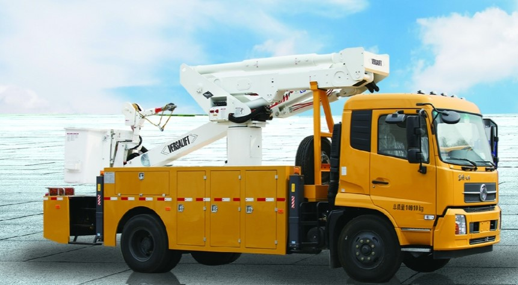</td>
<td></td>
</tr></table>

<table><tr>
<td>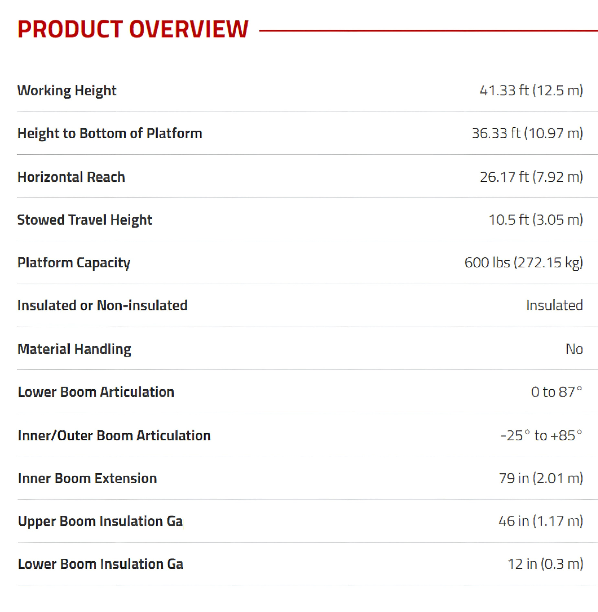</td>
<td>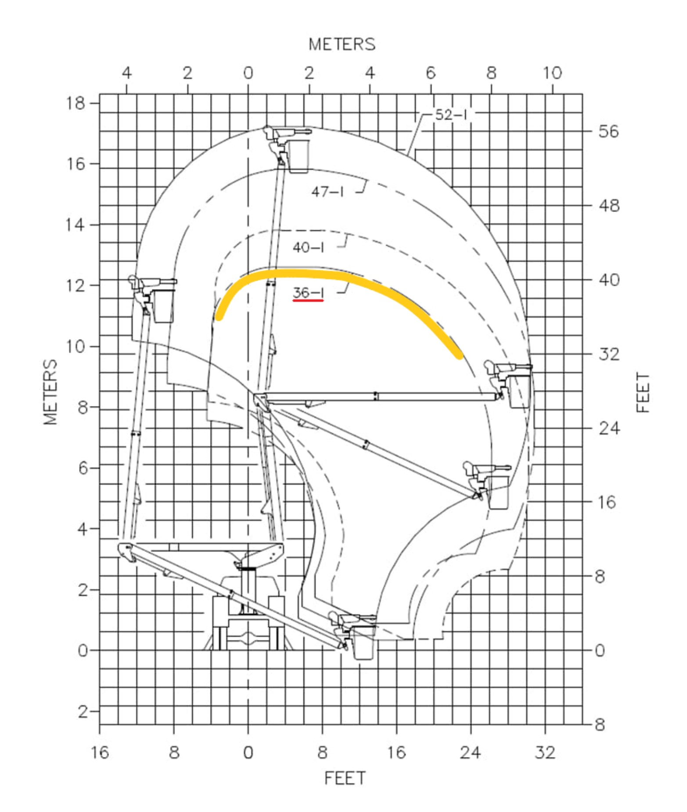</td>
</tr></table>

    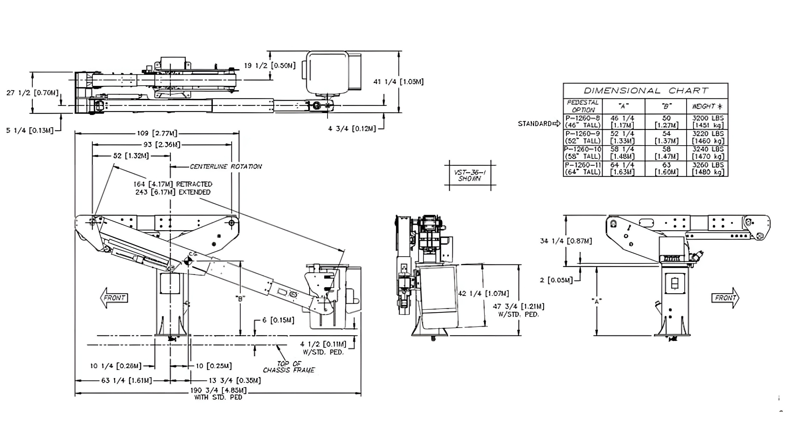

Fig 2. Some basic parameters of the Bucket Truck.   You can get more information form: ①<a href="https://zj.lmjx.net/gaokongzuoyeche/xcmg/xgs5143jgkz6/param/">XCMG-XGS5143JGKZ</a>. ② <a href="https://versalift.com/bucket-truck/vst-36-i/">VST-36-I</a>. ③ <a href="https://versalift.com/wp-content/uploads/2017/05/VST_36_404752-I_Final.pdf">Spec Sheet</a>
.

## MultiSensors Platform

 <table>
 <td width="40%">
 <table>
	<tr>
	    <th>Platform</th>
	</tr >
	<tr>
      <td rowspan="5">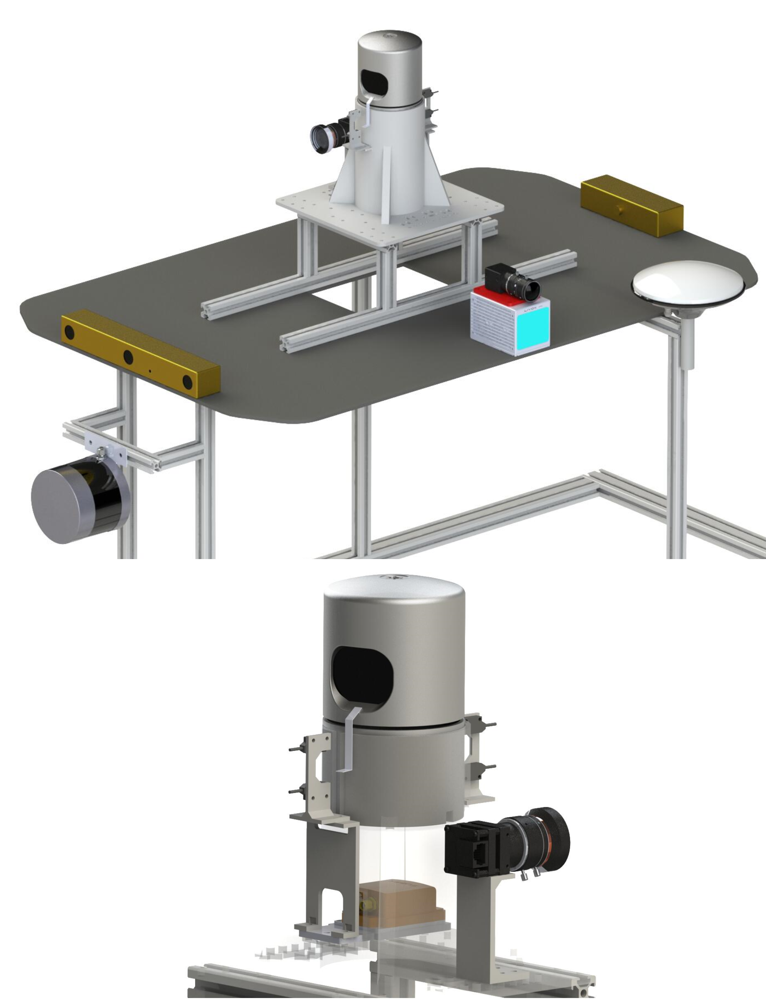</td>
	</tr>

</table>
</td>
<td>
 <table>
 <thead>
	<tr>
      <th>Sensor</th>
      <th>type</th> 
      <th>Rate</th>
      <th>Pics</th> 
	</tr >
  </thead>
	<tr>
      <td width="25%">INS/IMU</td>
      <td width="30%">Xsens MTi-G-710</td>
      <td width="15%">400 Hz</td>
      <td></td>
	</tr>
  <tr >
      <td width="25%">Horizontal Lidar</td>
      <td width="30%">Velodyne HDL-32E</td>
      <td width="10%">10 Hz</td>
      <td></td>
	</tr>
	<tr>
	    <td width="25%">Vertical Lidar</td>
      <td width="30%">Velodyne VLP-32C</td>
      <td width="10%">10 Hz</td>
      <td></td>
	</tr>
	<tr>
	    <td width="25%">MEMS Lidar</td>
      <td width="30%">LiVOX Avia</td>
      <td width="10%">10 Hz</td>
      <td></td>
	</tr>
	<tr>
	    <td width="25%">Stereo Camera front</td>
      <td width="30%">PointGrey Bumblebee xb3</td>
      <td width="10%">16 Hz</td>
      <td>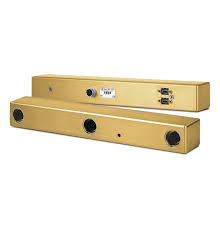</td>
	</tr>
  <tr>
	    <td width="25%">Stereo Camera back</td>
      <td width="30%">PointGrey Bumblebee xb2</td>
      <td width="10%">20 Hz</td>
      <td>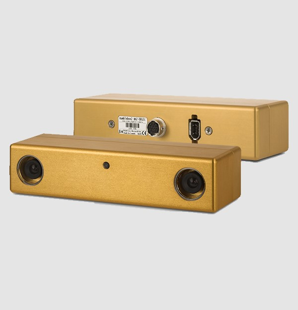</td>
	</tr>
	<tr>
	     <td width="25%">Mono Camera 1 (with HDL-32E)</td>
      <td width="30%">PointGrey CLMN-13S2C-CS</td>
      <td width="10%">18 Hz</td>
      <td></td>
	</tr>
	<tr>
	     <td width="25%">Mono Camera 2 (with LiVOX Avia)</td>
      <td width="30%">Hikvision MV-CE060-10UC</td>
      <td width="10%">40 Hz</td>
      <td></td>
	</tr>
</table>
</td>
</table>

    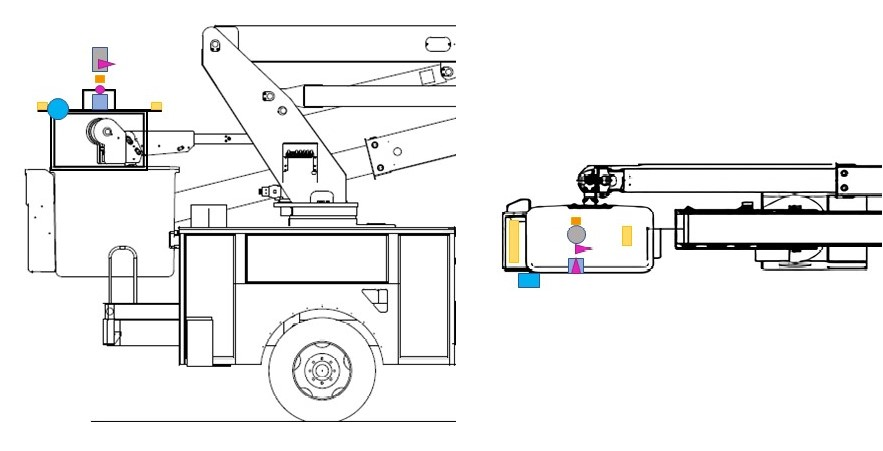

<table>
<tr>
<td>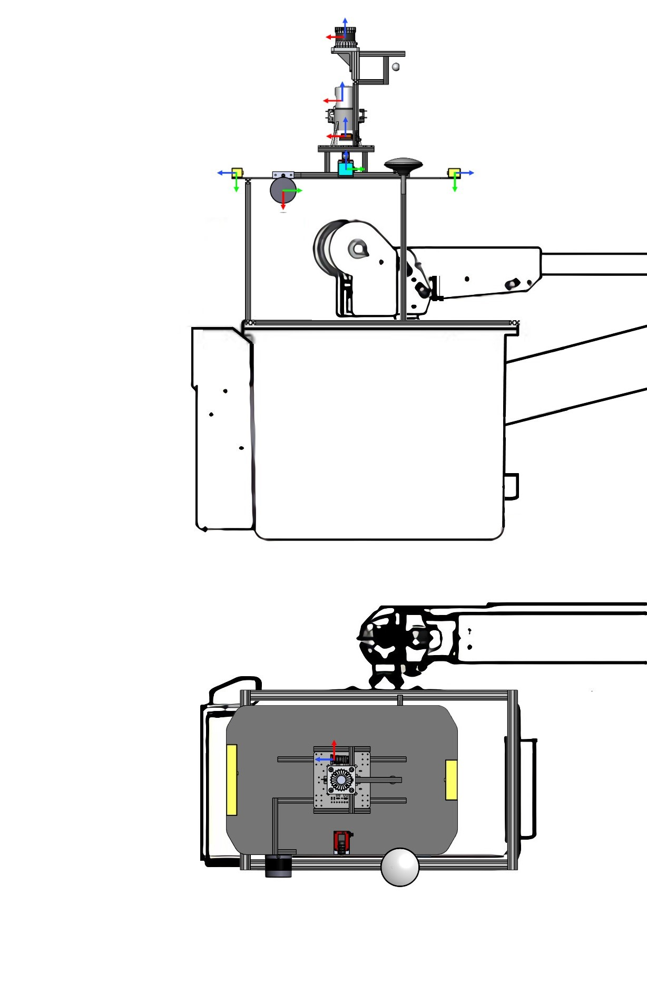</td>
<td>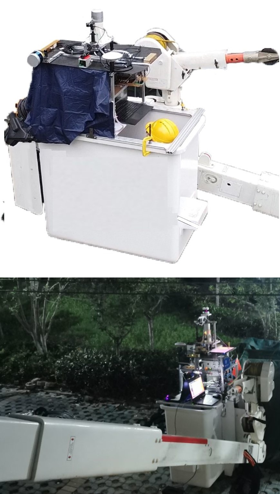</td>
</tr>
</table>

Fig 3. The MultiSensors Platform 
 

## Ground Truth
The two cameras are externally triggered to capture images at the same time. For images triggered at the same time, their time stamps are different by **at most 3 ms**. This satisfies the default hardcoded threshold in VINS-Fusion. See our tutorial on how to run VINS-Fusion with the dataset [here]().
