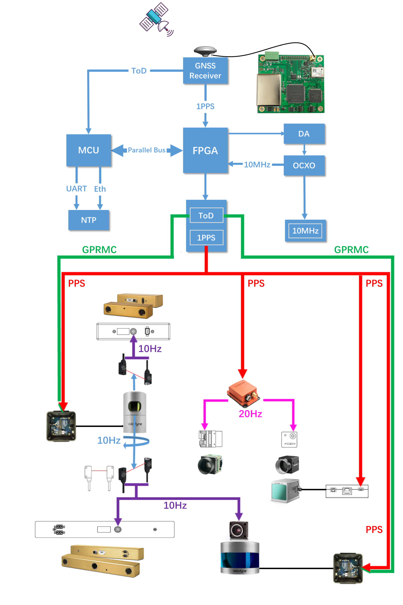
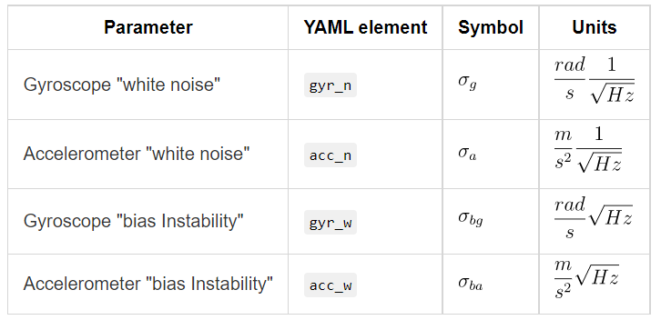
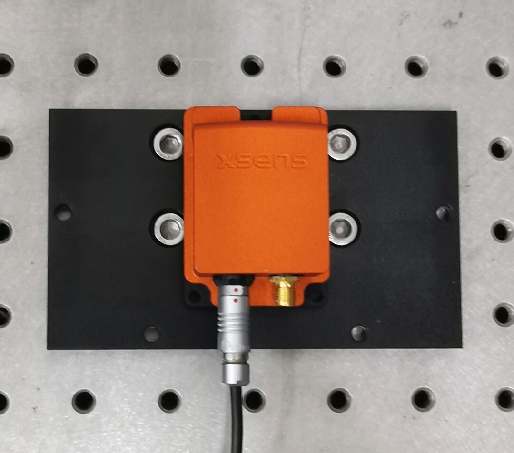
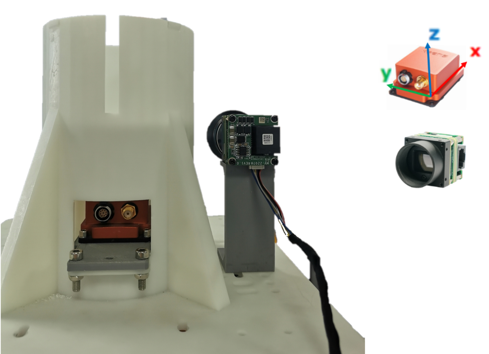
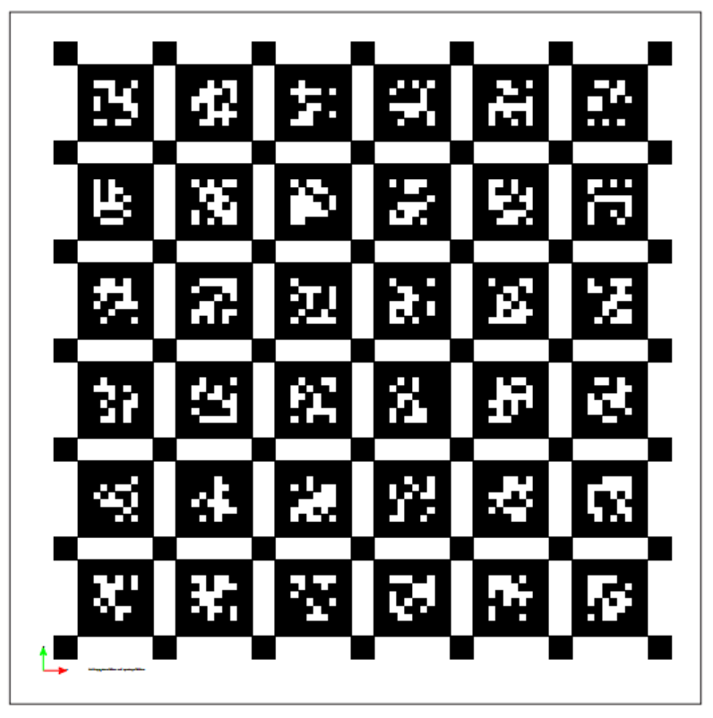
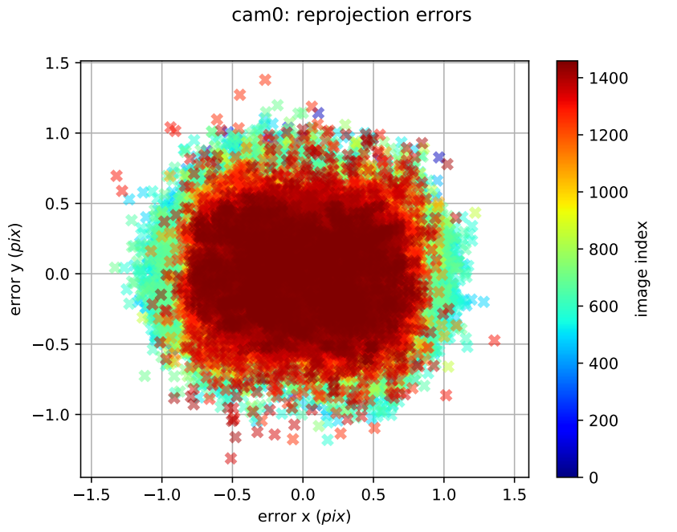
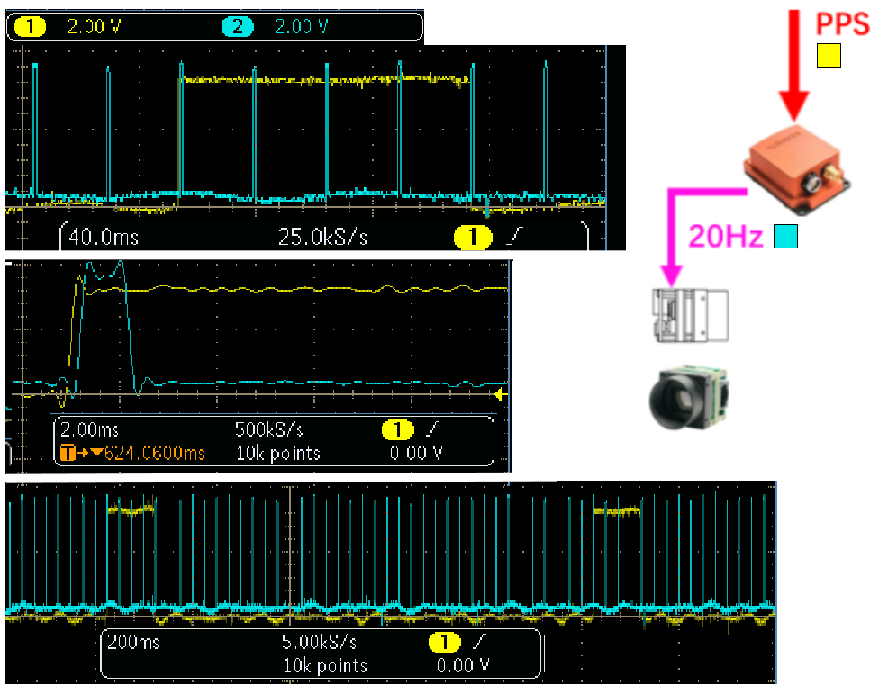

## Time Synchronization
<table><tr>
<td width="15%">
Look at this part        
Look at that part
</td>

<td width="70%">

    

</td>

<td width="15%">
Look at this part        
Look at that part
</td>
</tr></table>

## IMU
This part is about how we get IMU's gyroscope and accelerometer noise model parameters.

<td></td>

There are three IMUs in the system. First is 9DoF IMU Xsens MTi-G-710 INS/IMU, this is the main IMU of the system with the body frame attached on it. Second is the IMU in LiVOX Lidar which is a 6DoF IMU and well calibrated with LiVOX Lidar. Third is the IMU in ZED 2i stereo camera.

**Take the calibration of Xsens MTi-G-710 as an example:**

**step 1. Record Data**
<table><tr>
<td width="40%"></td>
<td width="60%">Place the IMU stationary on a stable platform for about 4hours and record the data of IMU in a rosbag.   Downlaod the rosbag file here:  <a href="https://rec.ustc.edu.cn/share/11af0a00-d284-11ec-b08d-51a354217a0f">https://rec.ustc.edu.cn/share/11af0a00-d284-11ec-b08d-51a354217a0f</a>  
 Downlaod the .mat data here:  <a href="https://rec.ustc.edu.cn/share/49f8f610-d28b-11ec-8fe1-07b3e2f7cce1">https://rec.ustc.edu.cn/share/49f8f610-d28b-11ec-8fe1-07b3e2f7cce1</a>
</td>
</tr></table>

**step 2. Calibrate**

The tools we use on our calibration are <a href="https://github.com/gaowenliang/imu_utils">imu_utils</a> and <a href="https://github.com/rpng/kalibr_allan">kalibr_allan</a>.
The topic 

> Age is an issue of mind over matter. If you don't mind, it doesn't matter.
<cite>Mark Twain</cite>
<small markdown="1">[Up to table of contents](#toc)</small>
{: .text-right }


**step 3. Get the Result**
## Camera-IMU
There are 
### 1.Transformation
We use <a href="https://github.com/search?q=Kalibr">Kalibr</a> to calib IMU and Cameras. 
<table><tr>
<td width="45%">

</td>
<td width="25%">

</td>
<td width="30%">

</td>
</tr></table>

### 2.Time estimate
<table><tr>
<td width="60%"></td>
<td>The IMU sensor is synced by PPS signal(1Hz Yellow).   IMU sync_out trigger line output the trigger signal of camera(20Hz Blue). </td>
</tr></table>

## Velodyne-IMU
### 1.Time Sync

## LiVOX-IMU
### 1.Time Sync

## Mono Cameras
There are 8 mono cameras in the system: 
Bumblebee_xb3 left/center/right 
Bumbelbee_xb2 left/right 
Hikvision_1 
Hikvision_2  

## Stereo Cameras

<a href="https://github.com/yzrobot/bumblebee_xb3/wiki/Stereo-vision-bumblebee-xb3-by-anshulpaigwar">Bumblebee_xb3 link</a>

## Velodyne-Cameras
### 1.Time sync

## LiVOX-Camera