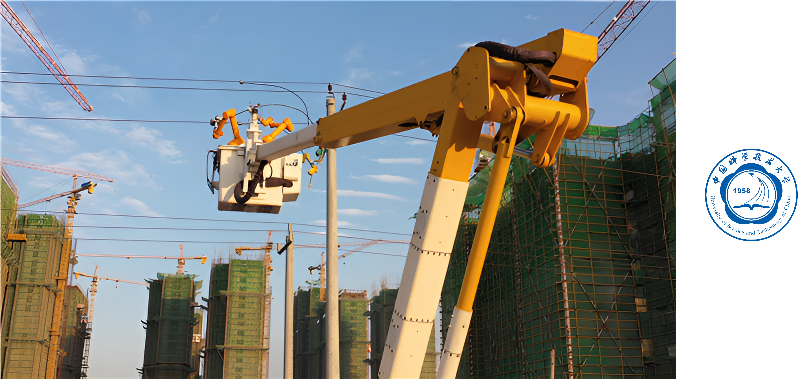
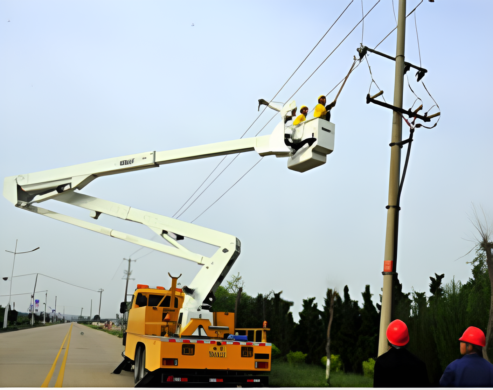
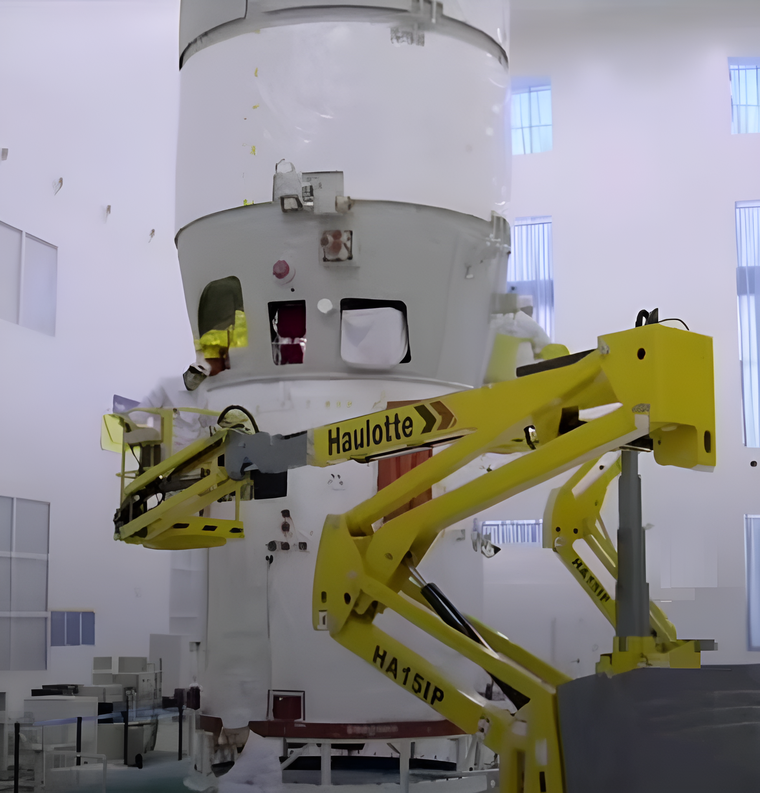
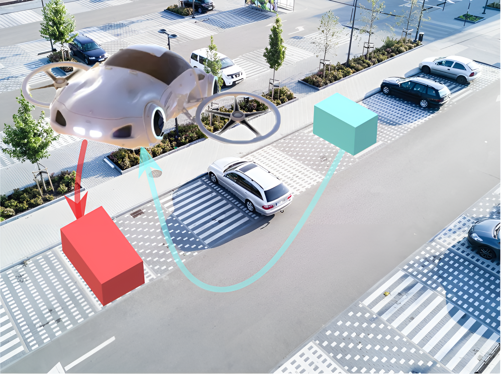

---
#
# Use the widgets beneath and the content will be
# inserted automagically in the webpage. To make
# this work, you have to use › layout: frontpage
#
layout: frontpage
header:
  image_fullwidth: header_unsplash_12.jpg

callforaction:
  url: https://www.google.com/chrome/?brand=BNSD&gclid=EAIaIQobChMI9ejb1fP_9QIVo5vCCh1EWgwXEAAYASAAEgKeg_D_BwE&gclsrc=aw.ds
  text: Google Chrome browser is recommended to open this website for faster response ›
  style: terminal
permalink: /index.html

widget1:
  title: "Downloads"
  url: '/datasets/index.html'
  image: unsplash_9.jpg
  text: ''
widget2:
  title: "Acquisition System"
  url: '/getting-started/index.html'
  image: acquisition_page1.jpg
  text: ''
widget3:
  title: "Sensors & Usage"
  url: '/design/index.html'
  image: sensors_page1.jpg
  text: ''
#
# Use the call for action to show a button on the frontpage
#
# To make internal links, just use a permalink like this
# url: /getting-started/
#
# To style the button in different colors, use no value
# to use the main color or success, alert or secondary.
# To change colors see sass/_01_settings_colors.scss
#

#
# This is a nasty hack to make the navigation highlight
# this page as active in the topbar navigation
#
homepage: true
---

# Welcome to the USTC FlyingCar Dataset!
##### We take advantage of our autonomous acquisition system "Giraffe" to develop novel challenging real-world computer vision benchmarks. Our tasks of interest are: stereo, optical flow, visual odometry, 3D object detection, 3D tracking and SLAM. For this purpose, we equipped a multisensors platform with two high-resolution color and grayscale video cameras. 

## Are We Ready for Aerial Work Robots?
<table>
  <tr>
    <td></td>
  </tr>
</table>

### Some aerial work scenarios in our daily life:
<table>
  <tr>
    <td></td>
    <td></td>
  </tr>
</table>

<table>
  <tr>
    <td></td>
    <td></td>
  </tr>
</table>

## The Vision of Our Research: Flying Car
<table>
  <tr>
    <td></td>
  </tr>
</table>

